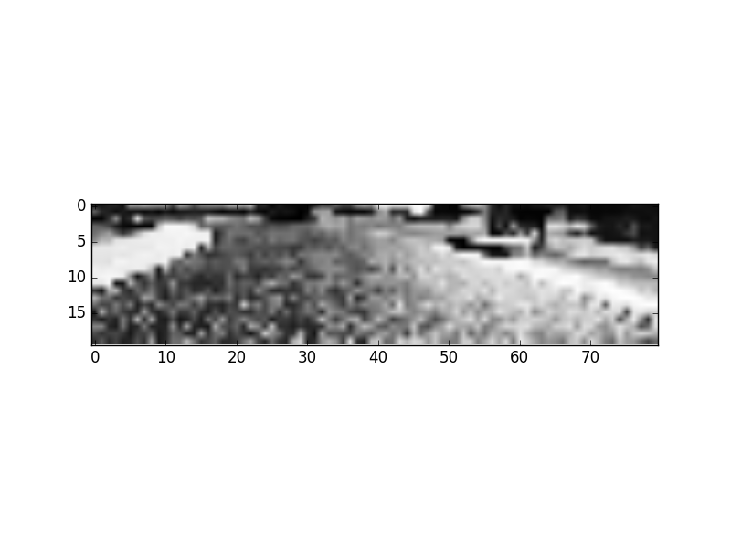
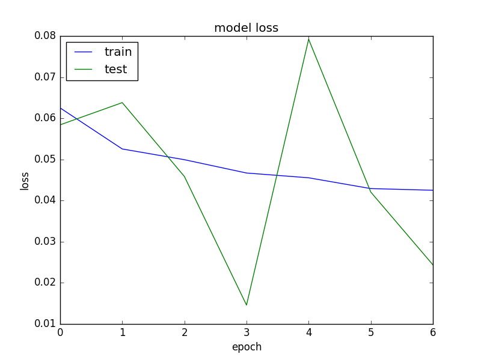
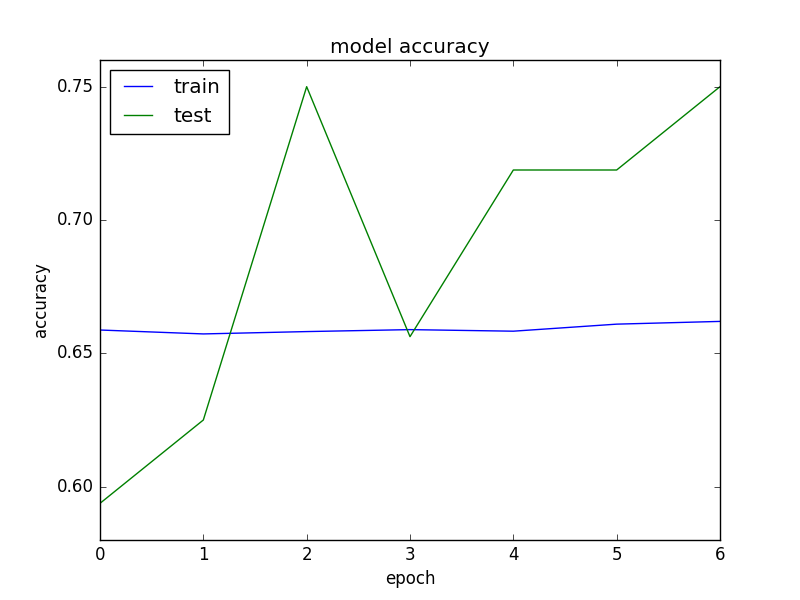

# Self-Driving Car Nanodegree - Udacity
## Project 3 :Behavioral Cloning
### Kwnaghyun JUNG

2nd Submission 8 JAN 2017

## Overview
```
1. make train data, recovery data by using simulator program.
2. build and train my network(use Keras)
  * Take in an image from the center camera of the car. This is the input to your neural network.
  * Output a new steering angle for the car.
3. Save your model architecture as model.json, and the weights as model.h5.  
4. Validating Your Network - You can validate your model by launching the simulator and entering autonomous mode.
```
### 1. Get training data , recovery data

I used only keyboard arrow key when using simulator. So some movements are so tough compared with using joystick. But after so may trying, I could do success track training.

**Traning data**

About 2 laps, I did  centerline driving,  in the middle of road. But it is often leaned to left. Because the track is almost left bend, so I want to safe turn.

**Recovery data**

I tried to make recovery data so many times, but it's so hard. Because when I go to right side of track and recover to center line, then there is wrong data from center to right side. Maybe that data effect to bad result.

So I make recovery data like filming movie. Starting from left lane and start recording, if the car enter to middle, then stop recording. (I called it 'CUT'). So I tried so many "Camera!", "Cut!" on many filming location. After that, I have full of recovery data on the track 1.


### 2. Pre-processing
```

1. Make filnename array from selected folder(directory)'s csv file
2. Split train set & test set using train_test_split(sklearn.model_selection) train : test = 85% : 15%
3. When processing model, model.filt_generator call 'generate_arrays_from_array()' function. This function 1)shuffle(only for traning set) 2)read image & image processing 3) return(yield) image & angles (only batch size)

```

**1. Get file name and make array (when program starts)**
The track data csv file has many fields, but I use only two field 'center, steering'

```
center,left,right,steering,throttle,brake,speed
IMG/center_2016_12_24_01_31_26_637.jpg, IMG/left_2016_12_24_01_31_26_637.jpg, IMG/right_2016_12_24_01_31_26_637.jpg, 0, 0.02501696, 0, 0.006750231
```

Get center(file name) and steering(angle) from csv file, and make array. If there is many folder, then add it also.

```python

tmp_center, tmp_angle = tmp_center, tmp_angle = read_csv_file("data_recovery","driving_log.csv", training=False)
center_fnames += tmp_center
steering_angles += tmp_angle
```


**2. Image Processing (genetrate process)**


Original(320x160)

There are 3 camera pictures on this captured data, but I only use centered camera. Because I want to use left or right camera's picture, but it's to difficult determine the "shift value" of wheel, and change to correct the distortion.

Every genetrate process below image processing is occurred.

```
center_img = cv2.imread(center, cv2.IMREAD_GRAYSCALE)
center_img = cv2.resize(center_img, (80, 40))  # resize image 80x40 (for fast process)
center_img = util.crop_driving_image(center_img) # crop 80x20
center_img = cv2.equalizeHist(center_img) # image processing

```


**[GRAYSCALE]** Original color image converted grayscale image when it is read from file. For simple processing.

**[RESIZE]** I've run the simulator on resolution (640 x 480). But the simulator always return the captured image (320 x 160). First time, I put raw data to in my model, but It's too big to process. And took too much time to train. So I changed it to quarter (80 x 40)


Grayscale & Resized(80 x 40)


**[CROP]** But, there is useless part in resized picture, yet. the bottom pixels and top pixels could be cropped. Becuase upper horizon part and car bumper part is can be noisy and make confused when training.

So, my last size **(80 x 20 )** [width, height]


Cropped(80 x 20)


**[Equalizes the histogram]** Equalizes the histogram of a grayscale image. when change image to graycale, there is some weaken part of image. So for more powerful processing, I equalizes the histrogram of image. After this processing, normalize the values of image from [0...255] to [0...1].



Equalizes the histogram (80x20)

(I delete flip processing in this submission)


### 3. Modeling

I make my model from the research <A href=" https://images.nvidia.com/content/tegra/automotive/images/2016/solutions/pdf/end-to-end-dl-using-px.pdf">[NVIDIA's paper]</A>. But I remove some layer and changed some part. I try to train more than hundred of times for this project, everytime I changed the shape of model and counting time and accuracy. So this is the last version of mine.

(Modified at this submission)
Added BatchNomalization Layer and 2 drop out layers. Change some size of filter & Dense size compared with 1st submission.

** add some

## X_train shape: (7693, 38, 160, 1) ##

Layer (type)       |              Output Shape     |     Param #   |  filter size
------|------------------|-------|-------------------|
**convolution2d_1** (Convolution2D)  |(None, 10, 40, 24)  |  240      |   (3x3) strides 2
batchnormalization_1 (BatchNorma |(None, 10, 40, 24)  |  48     |    Batch Normailization
activation_1 (Activation)       | (None, 10, 40, 24) |   0      |     
**convolution2d_2** (Convolution2D) | (None, 5, 20, 48)  |   10416   |    (3x3) strides 2
activation_2 (Activation)   |     (None, 5, 20, 48)  |   0      |     
**convolution2d_3** (Convolution2D) | (None, 5, 20, 96)   |  18528   |    (2x2)
activation_3 (Activation)     |   (None, 5, 20, 96)    | 0    |      
maxpooling2d_1 (MaxPooling2D)   | (None, 2, 10, 96)  |   0    |     maxpooling (2,2)
**convolution2d_4** (Convolution2D) | (None, 2, 10, 192) |   73920   |    (2x2)
activation_4 (Activation)      |  (None, 2, 10, 192)  |  0     |      
maxpooling2d_2 (MaxPooling2D) |   (None, 1, 5, 192)  |   0     |     maxpooling (2,2)
dropout_1 (Dropout)          |    (None, 1, 5, 192)   |  0    |      
flatten_1 (Flatten)           |   (None, 960)      |     0     |     
**dense_1** (Dense)                |  (None, 512)   |        492032   |   
activation_5 (Activation)      |  (None, 512)     |      0        |   
dropout_2 (Dropout)           |   (None, 512)    |       0     |     
**dense_2** (Dense)              |    (None, 256)      |     131328   |   
activation_6 (Activation)    |    (None, 256)     |      0    |     
**dense_3** (Dense)               |   (None, 256)       |    65792  |    
activation_7 (Activation)    |    (None, 256)   |        0     |    
**dense_4**(Dense)              |    (None, 1)      |       257    |    output (float)


**Total params: 792561**

```
Epoch : 20 (with EarlyStopping)
batch_size = 32
Adam Optimizer
mse(mean squared error)
```


**Training Result : The last value after 5 epoch,**
```
Epoch 1/20
6816/6816 [==============================] - 28s - loss: 0.0625 - acc: 0.6587 - val_loss: 0.0584 - val_acc: 0.5938
Epoch 2/20
6816/6816 [==============================] - 18s - loss: 0.0525 - acc: 0.6573 - val_loss: 0.0638 - val_acc: 0.6250
Epoch 3/20
6816/6816 [==============================] - 17s - loss: 0.0499 - acc: 0.6582 - val_loss: 0.0459 - val_acc: 0.7500
Epoch 4/20
6816/6816 [==============================] - 17s - loss: 0.0467 - acc: 0.6589 - val_loss: 0.0146 - val_acc: 0.6562
Epoch 5/20
6816/6816 [==============================] - 17s - loss: 0.0455 - acc: 0.6583 - val_loss: 0.0792 - val_acc: 0.7188
Epoch 6/20
6816/6816 [==============================] - 17s - loss: 0.0429 - acc: 0.6609 - val_loss: 0.0421 - val_acc: 0.7188
Epoch 7/20
6816/6816 [==============================] - 17s - loss: 0.0425 - acc: 0.6620 - val_loss: 0.0244 - val_acc: 0.7500

```
Validation loss starts from 0.0584, it decreased every epoch and stop at 0.425. And Test set Accuracy is start from 0.5938 and reach to 0.75 at epoch 7.

I use keras history object when it returns end of modeling, and the graph is below.


Loss


Accuracy

** generator
I make my own generator "generate_arrays_from_array". It return batch_size images array from input array which have image file names.

** early stopping
Put EarlyStopping for prohibit useless repeatition.
early_stopping = EarlyStopping(monitor='val_loss', patience=2)


## 4. Result : Test with simulator
Simulator must process same image processing when modeling. It returns one image (center camera), so I attach same image processing on it.
```
  imgString = data["image"]
  image = Image.open(BytesIO(base64.b64decode(imgString)))

  image_array = np.asarray(image)
  image_array = cv2.cvtColor( image_array, cv2.COLOR_RGB2GRAY ) # change to GrayImage

  image_array= cv2.resize(image_array, (80,40))  # resize
  image_array = util.crop_driving_image(image_array) # crop
  image_array = cv2.equalizeHist(image_array)  # equalize Histogram
  transformed_image_array = util.reformat_driving_image(image_array)
```
It is not fully satisfied result. Because I use keyboard input, so there is so many error and not continuos angle input (It is cut on every changing wheel) But it's cost is decreased on every epoch, and increased or maintained accuracy, so this model works.


** Some problem ** I made recovery data on configuration (640x480), Simple Graphics Quality. It runs well, doesn't go out of lane. But if change it's Graphics quality to Fantastic, it occurred some problem. Because some 'change angle' data is omitted when process complex graphic image, so car go out of lane. I'll improve more and more for safety driving considering this problem.

## 5. For improvement
**use left, right camera image** If use left & right camera image, then it's training can be more strengthen.
make smooth wheel angle

**speed is matter** Speed is import factor to change wheel angle. So when process model, speed factor must be attached by any method.

**More CORRECT traning data** The most error is because of my keyboard input error. More practice then, more best result. I think I'd rather than find someone who can car drive game very well. Or I must buy joystick.

**Is that right wheel angle?** The angle value is the value on the spot. i.e. it's not the "will be changed value". I think if I changed the angle, then I must check 'before angle' and 'next angle' and I must turn 'the difference of two'. Of course 'power' and 'car speed' is concerned. So, it is better to think about "next angle" not "this spot angle"
