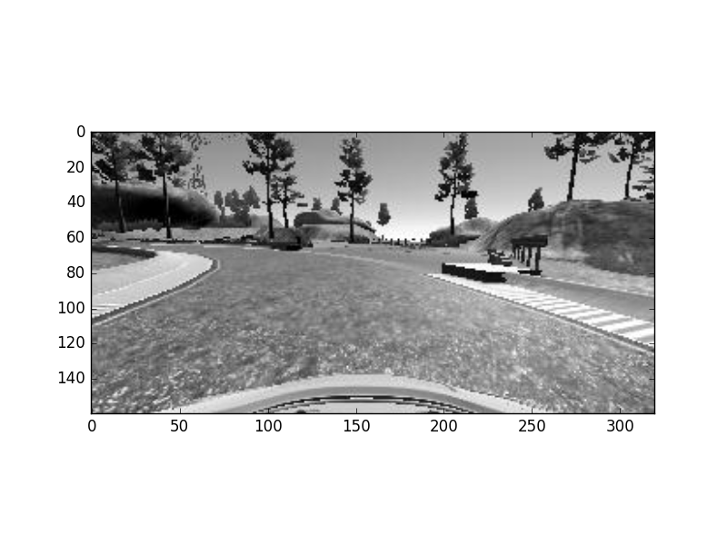
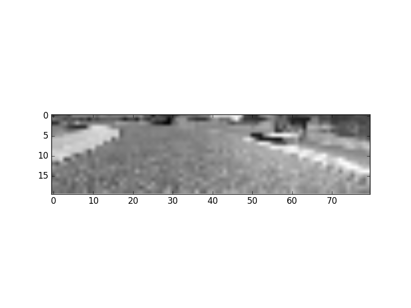

# Self-Driving Car Nanodegree - Udacity
## Project 3 :Behavioral Cloning
### Kwnaghyun JUNG 19 DEC 2016

## Overview
```
1. make train data, receovery data by using simulator program.
2. build and train my network(use Keras)
  * Take in an image from the center camera of the car. This is the input to your neural network.
  * Output a new steering angle for the car.
3. Save your model architecture as model.json, and the weights as model.h5.  
4. Validating Your Network - You can validate your model by launching the simulator and entering autonomous mode.
```
### 1. Get training data , recovery data

I've tried so many times running track with my keyboard on simulator. But It's not so easy thing which I think. Because, the speed of car is rapidly goes up to 30 mph, and that state, I cannot controll car correctly. It moves like drunken man. Because when I use keyboard instead of joystick, the control is so simple (left or right) and the angel is so sharp, so the car moves soon, out of control.

But in spite of that condition, I made so many data at 30 mph speed, but it doesn't work well in my model. It always went out of track.

So my choice, "limit speed at 10mph". It's so easy go to slow and the change angle is softer than when fast. So I've recollected all data again with speed approximately 10mph.

**Traning data**

About 3 laps, I did  centerline driving,  in the middle of road. But it is often leaned to left. Because the track is almost left bend, so I want to safe turn.

**Recovery data**

I tried to make recovery data so many times, but it's so hard. Because when I go to right side of track and recover to center line, then there is wrong data from center to right side. Maybe that data effect to bad result.

So I make recovery data like filming movie. Starting from left lane and start recording, if the car enter to middle, then stop recording. (I called it 'CUT'). So I tried so many "Camera!", "Cut!" on many filming location. After that, I have full of recovory data on the track 1.

### 2. Pre-processing
** Get file name **

There are two folders "data_hangulo3/" which is normal racing data, "data_recover/" which contains recovery data. In that folder there is 'driving_log.csv' file, and 'IMG' folder which have real images saved. First of all read csv files and divide into colums and extract only "center", "steering" labled which I put the first row myself. (When it made by simulator, there is no header like that.) After that, make list filenames and angles.

```python
tmp_center, tmp_angle = read_csv_file("data_hangulo3","driving_log.csv")
center_fnames += tmp_center
steering_angles += tmp_angle

tmp_center, tmp_angle = read_csv_file("data_recover","driving_log.csv")
center_fnames += tmp_center
steering_angles += tmp_angle
```


** Image Processing **


Original(320x160)

There are 3 camera pictures on this captured data, but I only use centered camera. Because I want to use left or right camera's picture, but it's to difficult determine the "shift value" of wheel, and change to correct the distortion. (Of course, I'll try and try.)

**[RESIZE]** I've run the simulator on resolution (640 x 480). But the simulator always return the captured image (320 x 160). First time, I put raw data to in my model, but It's too big to process. And took too much time to train. So I changed it to half (180 x 80)



Resized(160 x 80)


**[CROP]** But, there is useless part in resized picture, yet. the bottom pixels and top pixels could be cropped. Becuase upper horizon part and car bumper part is can be noisy and make confused when training.

So, my last size **(160 x 38 )** [width, height]


Cropped(160 x 38)


**[GRAYSCALE & Normalize]** And it dosen't need to be color, so I make it grayscale image. And for simple and for good training, nomalize the values of image. From [0:255] to [0:1] (float value)


grayscale(160 x 38)


**[Random flip]** Track1 has many left-turns. So I found trained car is leaned almost left. And it occured some wrong driving result. So I make 10% of images flip vertical randomly. Everytime process images, it is filpped with 10% ratio. I think it's good idea, if track has many left turn and right turn mixed, then make all images flip, and add to train set. Important thing is when the image flipped, then the wheel angle changed sign. From (-) to (+) vise versa


```python
def make_image_arrays_flip (imgs, angles) : # change image to flip
  for i, img, angle in zip( range(len(imgs)), imgs, angles) :
    if(np.random.choice(10) == 0 ) : #10%
      imgs[i], angles[i]  = make_image_flip(img,angle) # flip
    return imgs, angles
```


flip(160 x 38) [random 10%]

**[Split training set & validation set]** There is no labeled data (angles), so I split training data to parts. the ratio is traning : validation = 90 : 10.
```python
X_train, X_test, y_train, y_test = train_test_split(X_train, y_train,
                                                        test_size=0.1,
                                                        random_state=0)

```                                                                


### 3. Modeling

I make my model from the research <A href=" https://images.nvidia.com/content/tegra/automotive/images/2016/solutions/pdf/end-to-end-dl-using-px.pdf">[NVIDIA's paper]</A>. But I remove some layer and changed some part. I try to train more than hundred of times for this project, everytime I changed the shape of model and counting time and accuracy. So this is the last version of mine.


## X_train shape: (7693, 38, 160, 1) ##
Layer (type)       |              Output Shape     |     Param #   |  filter size
-------------------|-------------------|-------------------|-------------------|
**convolution2d_1** (Convolution2D) | (None, 19, 80, 24)  |  624     |   (5 x 5) strides 2
activation_1 (Activation: ReLU)   |     (None, 19, 80, 24)  |  0       |    
**convolution2d_2** (Convolution2D) | (None, 8, 38, 36)   |  21636   |    (5 x 5) strides 2
activation_2 (Activation: ReLU)      |  (None, 8, 38, 36)   |  0        |   
**convolution2d_3** (Convolution2D) | (None, 8, 38, 48)   |  43248    |   (5 x 5) strides 1
activation_3 (Activation: ReLU)   |     (None, 8, 38, 48)   |  0         |  
maxpooling2d_1 (MaxPooling2D: ReLU) |   (None, 4, 19, 48)  |   0        |   maxpooling (2,2)
**convolution2d_4** (Convolution2D) | (None, 2, 17, 64)   |  27712     |  (3 x 3) stride 1
activation_4 (Activation: ReLU)   |     (None, 2, 17, 64)   |  0        |   
maxpooling2d_2 (MaxPooling2D)  |  (None, 1, 8, 64)   |   0    |        maxpooling (2,2)
**flatten_1** (Flatten)          |    (None, 512)       |    0       |    
**dense_1** (Dense)             |     (None, 100)      |     51300   |    
activation_5 (Activation: ReLU)   |     (None, 100)      |     0     |    
**dense_2** (Dense)              |    (None, 100)       |    10100   |    
activation_6 (Activation: ReLU)     |   (None, 100)     |      0     |    
**dense_3** (Dense)              |    (None, 50)      |      5050   |     
activation_7 (Activation: ReLU)   |     (None, 50)       |     0     |    
**dense_4** (Dense)              |    (None, 10)     |       510   |      
activation_8 (Activation: ReLU)    |    (None, 10)      |      0       |  
**dense_5** (Dense)              |    (None, 1)      |       11     |     Output (float)

**Total params: 160191**

**Train on 7693 samples, validate on 855 samples**
```
Epoch : 5
batch_size = 32
```

I tried many times on verious epoch. But there is no need more than 5 epoch. The accuracy is no more than imporoved after epoch 5. So I want to prevent overfitting, limit only 5 epoch. It saves much time and the result is so statisfied.

** The reson of no Dropout ** If you see my model, then you can have question, 'Why there is not Dropout layer?'. Ok, dropout layer is very efficient method to prevent overfitting. So, first time, I put many drop out layer between layers. But strange result is occured. All output is stick to one value. So my car always go out of lane, and goes some neverland. (You know, this simulator can go under the water and cross to rock.)

So, after few days struggling, I found that if remove all dropout layer, then it works! So, I delete all dropout layers. I think I have only 5 epoch and data set is not too big, so it is usless dropout layer.


**Training Result : The last value after 5 epoch,**
loss: 0.0326 - acc: 0.6841 - val_loss: 0.0315 - val_acc: 0.6807

The accuracy is near 68% ~ 69%. If I add some epoch, but it is not imporoved. This is best result from this model and training data.

## 4. Result : Test with simulator
The testing module have no speed controller. It's speed is increased until max speed (30mph). As I mentioned my train model is based on the **speed approx. 10 mph.** So I've changed some code, now, the car's speed is limited near 10 mph.

```python
   if( speed < 10) : # limit speed until 10 mph
       throttle = 0.2
   else :
       throttle = 0.1
```
You can see the simulation result at Youtube (https://youtu.be/4wXXPss54Bw). It is a little slow, but it runs well.
In fact, I've tested on faster speed environment, if speed limit is increased 20mph, then first lap is OK, but second lap, the car goes neverland. Under limitation 30mph, the first lap is faied. This is so simple reason. This simulation model have no factor about ***"SPEED"*** Under low speed, the wheel's angle is changed a little bit large and long time, but under high speed, you need change angle a little bit small and shortly maintained. My model is 10mph angle is larger than 30mph's so it runs out of track, with diffrent speed. If I have joystick or more training the keyboard control, then I want to try 30mph model also.

## 5. For improvement
**use left, right camera image** If use left & right camera image, then it's training can be more strengthen.
make smooth wheel angle

**speed is matter** Speed is import factor to change wheel angle. So when process model, speed factor must be attached by any method.

**More CORRECT traning data** The most error is because of my keyboard input error. More practice then, more best result. I think I'd rather than find someone who can car drive game very well. Or I must buy joystick.

**Is that right wheel angle? ** The angle value is the value on the spot. i.e. it's not the "will be changed value". I think if I changed the angle, then I must check 'before angle' and 'next angle' and I must turn 'the diffrence of two'. Of course 'power' and 'car speed' is concerned. So, it is better to think about "next angle" not "this spot angle"
